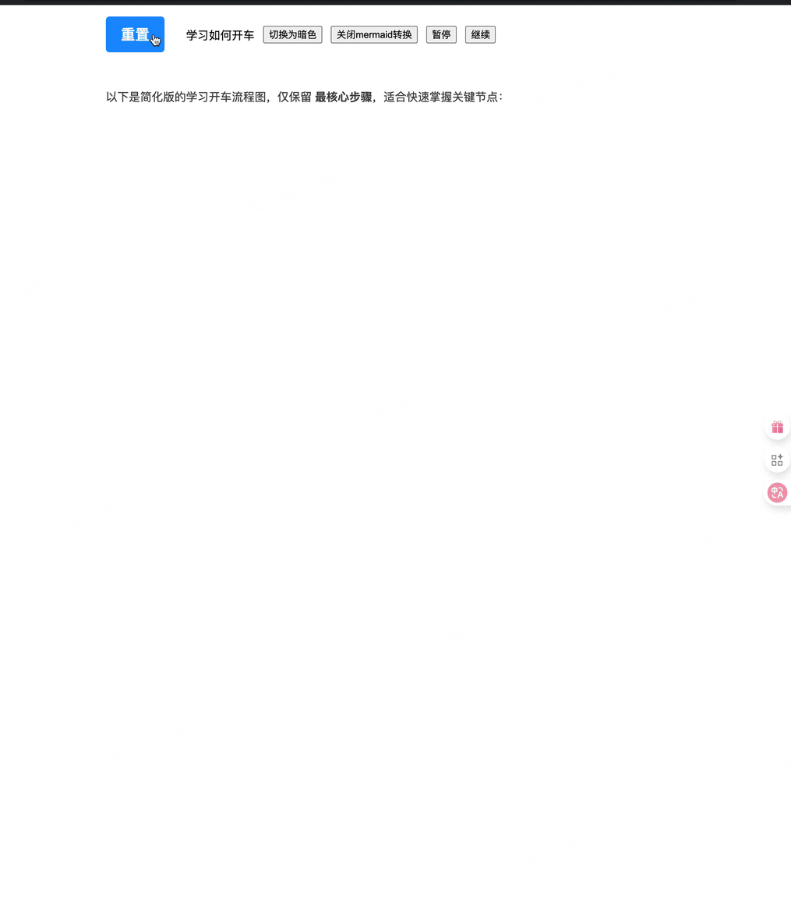

# ds-markdown

> 🚀 High-performance React Markdown typing animation component, perfectly replicating DeepSeek chat interface effects

**🇺🇸 English | [🇨🇳 中文](./README.md)**

A React component designed specifically for modern AI applications, providing smooth real-time typing animations and complete Markdown rendering capabilities.

[](https://www.npmjs.com/package/ds-markdown)
[](https://www.npmjs.com/package/ds-markdown)
[](https://bundlephobia.com/package/ds-markdown)
[](https://react.dev)
[](https://www.typescriptlang.org/)

- [Documentation](https://onshinpei.github.io/ds-markdown/)
- Usage Examples
  - [Basic Usage](https://stackblitz.com/edit/vitejs-vite-ddfw8avb?file=src%2FApp.tsx)
  - [Streaming Data Usage](https://stackblitz.com/edit/vitejs-vite-2ri8kex3?file=src%2FApp.tsx)
  - [Mermaid Charts](https://stackblitz.com/edit/vitejs-vite-iqbyta3j?file=index.html)
  - [Math Formulas Demo 1](https://stackblitz.com/edit/vitejs-vite-iqbyta3j?file=index.html)
  - [Math Formulas Demo 2](https://stackblitz.com/edit/vitejs-vite-xk9lxagc?file=src%2FApp.tsx)

If you want a clean `react markdown` typing component, you can use [react-markdown-typer](https://github.com/onshinpei/react-markdown-typer)

---

## ❓ Why use ds-markdown?

### 🎯 **Core Problems Solved**

- **Streaming Data Typing Stuttering Issues**  
  Traditional typewriter components experience stuttering and character jumping when processing AI backend streaming data, as each chunk contains multiple characters. ds-markdown intelligently splits each chunk to ensure smooth typing for every character.

- **Markdown Rendering and Typing Animation Disconnection**  
  Most typewriter components only support plain text and cannot render Markdown syntax, mathematical formulas, charts, and other rich media content in real-time during typing.

### 🚀 **Value Delivered**

- **Enhanced User Immersion**  
  Provides professional-level AI chat experience, allowing users to feel authentic AI interaction processes, greatly improving product professionalism and user satisfaction.

- **Out-of-the-box, Reduces Development Complexity**  
  Complete solution that requires no additional configuration to support streaming data, Markdown rendering, mathematical formulas, charts, and other complex features.

- **Adapts to Multiple Application Scenarios**  
  From AI chatbots to educational content display, from technical documentation to product demos, one component meets multiple needs.

---

## Table of Contents

- [ds-markdown](#ds-markdown)
  - [❓ Why use ds-markdown?](#-why-use-ds-markdown)
    - [🎯 **Core Problems Solved**](#-core-problems-solved)
    - [🚀 **Value Delivered**](#-value-delivered)
  - [Table of Contents](#table-of-contents)
  - [✨ Core Features](#-core-features)
    - [🤖 **AI Chat Scenarios**](#-ai-chat-scenarios)
    - [📊 **Content Display Scenarios**](#-content-display-scenarios)
    - [🎨 **UI Component System 🆕**](#-ui-component-system-)
    - [🔧 **Development Experience**](#-development-experience)
    - [🎬 **Smooth Animation**](#-smooth-animation)
    - [⚡ **Performance Optimization**](#-performance-optimization)
  - [📦 Quick Installation](#-quick-installation)
    - [Using via ESM CDN](#using-via-esm-cdn)
  - [🚀 5-Minute Quick Start](#-5-minute-quick-start)
    - [Basic Usage](#basic-usage)
    - [Disable Typing Animation](#disable-typing-animation)
    - [Mathematical Formula Support](#mathematical-formula-support)
    - [AI Chat Scenarios](#ai-chat-scenarios)
    - [Code Block Features 🆕](#code-block-features-)
    - [Mermaid Chart Support](#mermaid-chart-support)
  - [📚 Complete API Documentation](#-complete-api-documentation)
    - [Default export DsMarkdown and MarkdownCMD props](#default-export-dsmarkdown-and-markdowncmd-props)
    - [IBeforeTypedChar](#ibeforetypedchar)
    - [ITypedChar](#itypedchar)
      - [IMarkdownMath](#imarkdownmath)
      - [IMarkdownCode 🆕](#imarkdowncode-)
      - [IMarkdownPlugin](#imarkdownplugin)
    - [Component Exposed Methods](#component-exposed-methods)
      - [Default export DsMarkdown](#default-export-dsmarkdown)
      - [MarkdownCMD Exposed Methods](#markdowncmd-exposed-methods)
  - [🔌 Plugin System](#-plugin-system)
    - [Built-in Plugins](#built-in-plugins)
      - [KaTeX Mathematical Formula Plugin](#katex-mathematical-formula-plugin)
      - [Mermaid Chart Plugin 🆕](#mermaid-chart-plugin-)
    - [Custom Plugins](#custom-plugins)
  - [🎨 UI Component System 🆕](#-ui-component-system--1)
    - [Core Components](#core-components)
    - [Style Customization](#style-customization)
  - [Multi-language Configuration](#multi-language-configuration)
  - [💡 Practical Examples](#-practical-examples)
    - [📝 AI Streaming Chat](#-ai-streaming-chat)
  - [🔧 Best Practices](#-best-practices)
    - [1. Performance Optimization](#1-performance-optimization)
    - [2. Streaming Data Processing](#2-streaming-data-processing)
    - [3. Mathematical Formula Optimization](#3-mathematical-formula-optimization)
    - [4. Mermaid Chart Best Practices 🆕](#4-mermaid-chart-best-practices-)

## ✨ Core Features

### 🤖 **AI Chat Scenarios**

- Professional-level AI chat response effects, comparable to mainstream AI platform experiences
- Supports thinking process (`thinking`) and answer content `answer`) dual modes
- Perfect streaming data adaptation with zero-delay response to user input

### 📊 **Content Display Scenarios**

- Complete Markdown syntax support, including code highlighting, tables, lists, etc.
- Mathematical formula rendering (KaTeX), supporting `$...$` and `\[...\]` syntax
- Mermaid chart support, including flowcharts, sequence diagrams, Gantt charts, class diagrams, etc. 🆕
- Supports light/dark themes, adapting to different product styles
- Plugin architecture supporting remark/rehype plugin extensions

### 🎨 **UI Component System 🆕**

- Code block and chart enhancement features: copy, download, language, etc.
- Built-in rich UI components: Button, IconButton, ToolTip, Segmented, etc.
- Complete interactive experience and accessibility support

### 🔧 **Development Experience**

- Rich imperative API: `start`, `stop`, `resume`, `restart`, etc.
- Supports typing interruption and continuation, flexible control of animation states
- Supports typing on/off, meeting different scenario requirements
- Complete TypeScript type support

### 🎬 **Smooth Animation**

- Dual-mode timer optimization, supporting `requestAnimationFrame` and `setTimeout` modes
- High-frequency typing support (typing interval can be as low as close to `0ms` in `requestAnimationFrame` mode)
- Frame-synchronized rendering, perfectly coordinated with browser refresh
- Intelligent character batch processing for more natural visual effects

### ⚡ **Performance Optimization**

- Lightweight design, small size and excellent performance
- Core dependency [react-markdown](https://github.com/remarkjs/react-markdown), no heavyweight dependencies

---

## 📦 Quick Installation

```bash
# npm
npm install ds-markdown

# yarn
yarn add ds-markdown

# pnpm
pnpm add ds-markdown
```

### Using via ESM CDN

No installation required, use directly in the browser:

[DEMO](https://stackblitz.com/edit/stackblitz-starters-7vcclcw7?file=index.html)

```html
<!-- Import styles, required -->
<link rel="stylesheet" href="https://esm.sh/ds-markdown/dist/style.css" />

<!-- Import KaTeX math formula styles, only import if needed -->
<link rel="stylesheet" href="https://esm.sh/ds-markdown/dist/katex.css" />

<!-- Import component -->
<script type="module">
  import Markdown from 'https://esm.sh/ds-markdown';
</script>
```

## 🚀 5-Minute Quick Start

> ✅ Starting from v1.0+, you no longer need to manually import `ds-markdown/style.css`; the component automatically injects the required base styles.

### Basic Usage

[DEMO](https://stackblitz.com/edit/vitejs-vite-z94syu8j?file=src%2FApp.tsx)

```tsx
import DsMarkdown from 'ds-markdown';

function App() {
  return (
    <DsMarkdown interval={20} answerType="answer">
      # Hello ds-markdown This is a **high-performance** typing animation component! ## Features - ⚡ Zero-delay streaming processing - 🎬 Smooth typing animation - 🎯 Perfect syntax support
    </DsMarkdown>
  );
}
```

### Disable Typing Animation

```tsx
import DsMarkdown from 'ds-markdown';

function StaticDemo() {
  const [disableTyping, setDisableTyping] = useState(false);

  return (
    <div>
      <button onClick={() => setDisableTyping(!disableTyping)}>{disableTyping ? 'Enable' : 'Disable'} Typewriter Effect</button>

      <DsMarkdown interval={20} answerType="answer" disableTyping={disableTyping}>
        # Static Display Mode When `disableTyping` is `true`, content will be displayed immediately without typing animation effects. This is very useful in certain scenarios: - 📄 Static document
        display - 🔄 Switching display modes - ⚡ Quick content preview
      </DsMarkdown>
    </div>
  );
}
```

### Mathematical Formula Support

```tsx
import DsMarkdown from 'ds-markdown';
// If you need to display formulas, you need to import the formula conversion plugin
import { katexPlugin } from 'ds-markdown/plugins';
import 'ds-markdown/style.css';
// If you need to display formulas, you need to import math formula styles
import 'ds-markdown/katex.css';

function MathDemo() {
  return (
    <DsMarkdown interval={20} answerType="answer" plugins={[katexPlugin]} math={{ splitSymbol: 'dollar' }}>
      # Pythagorean Theorem In a right triangle, the square of the hypotenuse equals the sum of the squares of the two legs: $a^2 + b^2 = c^2$ Where: - $a$ and $b$ are the legs - $c$ is the hypotenuse
      For the classic "3-4-5 triangle": $c = \sqrt{3 ^ (2 + 4) ^ 2} = \sqrt{25} = 5$
    </DsMarkdown>
  );
}
```

### AI Chat Scenarios

```tsx
function ChatDemo() {
  const [thinking, setThinking] = useState('');
  const [answer, setAnswer] = useState('');

  const handleAsk = () => {
    setThinking('🤔 Thinking about your question...');

    setTimeout(() => {
      setAnswer(`# About React 19

React 19 brings many exciting new features:

## 🚀 Major Updates
1. **React Compiler** - Automatic performance optimization
2. **Actions** - Simplified form handling
3. **Document Metadata** - Built-in SEO support

Let's explore these new features together!`);
    }, 2000);
  };

  return (
    <div>
      <button onClick={handleAsk}>Ask AI</button>

      {thinking && (
        <DsMarkdown answerType="thinking" interval={30}>
          {thinking}
        </DsMarkdown>
      )}

      {answer && (
        <DsMarkdown answerType="answer" interval={15}>
          {answer}
        </DsMarkdown>
      )}
    </div>
  );
}
```

### Code Block Features 🆕

```tsx
import DsMarkdown from 'ds-markdown';

function CodeBlockDemo() {
  const codeContent = `# Hello World

\`\`\`javascript
function greet(name) {
  console.log(\`Hello, \${name}!\`);
}

greet('ds-markdown');
\`\`\`

Supports code highlighting, copying, and downloading!`;

  return (
    <DsMarkdown
      interval={20}
      answerType="answer"
      codeBlock={{
        headerActions: true, // Enable code block header action buttons
      }}
    >
      {codeContent}
    </DsMarkdown>
  );
}
```

### Mermaid Chart Support

[DEMO](https://stackblitz.com/edit/vitejs-vite-iqbyta3j?file=README.md)

```tsx
import DsMarkdown from 'ds-markdown';
import { ConfigProvider } from 'ds-markdown';
import mermaidPlugin from 'ds-markdown-mermaid-plugin';
import 'ds-markdown/style.css';

function MermaidDemo() {
  const chartContent = `Here's a simplified learning to drive flowchart, keeping only the **most core steps**, suitable for quickly mastering key nodes:

\`\`\`mermaid
graph TD
    A[Start] --> B[Subject 1: Theory Exam]
    B --> C[Subject 2: Field Five Items]
    C --> D[Subject 3: Road Test]
    D --> E[Subject 4: Safety Written Test]
    E --> F[Get Driver's License]
    F --> G[Actual Driving Practice]
\`\`\`

### Minimalist Explanation:
1. **Theory First**: Pass traffic rules written test (Subject 1).
2. **Field Basics**: Practice reversing, hill starts, etc. (Subject 2).
3. **Road Combat**: Actual road driving test (Subject 3).
4. **Safety Finish**: Pass Subject 4 to get license.
5. **Continuous Proficiency**: Continue practicing after getting license to adapt to real road conditions.

### Visualization Suggestions:
- When sketching with phone memo or white paper, write steps in **arrow order**.
- Want more intuitive? Use circular sticky notes for each subject, connect them into a flow.`;

  return (
    <ConfigProvider>
      <DsMarkdown interval={20} answerType="answer" plugins={[mermaidPlugin]}>
        {chartContent}
      </DsMarkdown>
    </ConfigProvider>
  );
}
```



---

## 📚 Complete API Documentation

### Default export DsMarkdown and MarkdownCMD props

```js
import DsMarkdown, { MarkdownCMD } from 'ds-markdown';
```

| Property            | Type                                        | Description                                                                                                             | Default Value                                                                 |
| ------------------- | ------------------------------------------- | ----------------------------------------------------------------------------------------------------------------------- | ----------------------------------------------------------------------------- |
| `interval`          | `number`                                    | Typing interval (milliseconds)                                                                                          | `30`                                                                          |
| `timerType`         | `'setTimeout'` \| `'requestAnimationFrame'` | Timer type, does not support dynamic modification                                                                       | Current default is `setTimeout`, will change to `requestAnimationFrame` later |
| `answerType`        | `'thinking'` \| `'answer'`                  | Content type (affects style theme), does not support dynamic modification                                               | `'answer'`                                                                    |
| `theme`             | `'light'` \| `'dark'`                       | Theme type                                                                                                              | `'light'`                                                                     |
| `plugins`           | `IMarkdownPlugin[]`                         | Plugin configuration                                                                                                    | `[]`                                                                          |
| `math`              | [IMarkdownMath](#IMarkdownMath)             | Mathematical formula configuration                                                                                      | `{ splitSymbol: 'dollar' }`                                                   |
| `onEnd`             | `(data: EndData) => void`                   | Typing completion callback                                                                                              | -                                                                             |
| `onStart`           | `(data: StartData) => void`                 | Typing start callback                                                                                                   | -                                                                             |
| `onBeforeTypedChar` | `(data: IBeforeTypedChar) => Promise<void>` | Callback before character typing, supports async operations, blocks subsequent typing                                   | -                                                                             |
| `onTypedChar`       | `(data: ITypedChar) => void`                | Callback after each character typing                                                                                    | -                                                                             |
| `disableTyping`     | `boolean`                                   | Disable typing animation effects                                                                                        | `false`                                                                       |
| `autoStartTyping`   | `boolean`                                   | Whether to automatically start typing animation, set to false for manual trigger, does not support dynamic modification | `true`                                                                        |
| `codeBlock`         | `IMarkdownCode`                             | Code block configuration                                                                                                | `{headerActions: true}`                                                       |

> Note: If `disableTyping` changes from `true` to `false` during typing

### IBeforeTypedChar

| Property       | Type         | Description                                  | Default Value |
| -------------- | ------------ | -------------------------------------------- | ------------- |
| `currentIndex` | `number`     | Current character index in the entire string | `0`           |
| `currentChar`  | `string`     | Current character about to be typed          | -             |
| `answerType`   | `AnswerType` | Content type (thinking/answer)               | -             |
| `prevStr`      | `string`     | Prefix string of current type content        | -             |
| `percent`      | `number`     | Typing progress percentage (0-100)           | `0`           |

### ITypedChar

| Property       | Type         | Description                                  | Default Value |
| -------------- | ------------ | -------------------------------------------- | ------------- |
| `currentIndex` | `number`     | Current character index in the entire string | `0`           |
| `currentChar`  | `string`     | Current typed character                      | -             |
| `answerType`   | `AnswerType` | Content type (thinking/answer)               | -             |
| `prevStr`      | `string`     | Prefix string of current type content        | -             |
| `currentStr`   | `string`     | Complete string of current type content      | -             |
| `percent`      | `number`     | Typing progress percentage (0-100)           | `0`           |

#### IMarkdownMath

| Property      | Type                      | Description                 | Default Value |
| ------------- | ------------------------- | --------------------------- | ------------- |
| `splitSymbol` | `'dollar'` \| `'bracket'` | Math formula delimiter type | `'dollar'`    |

**Delimiter Description:**

- `'dollar'`: Uses `$...$` and `$$...$$` syntax
- `'bracket'`: Uses `\(...\)` and `\[...\]` syntax

#### IMarkdownCode 🆕

| Property        | Type      | Description                           | Default Value |
| --------------- | --------- | ------------------------------------- | ------------- |
| `headerActions` | `boolean` | Whether to show header action buttons | `true`        |

#### IMarkdownPlugin

| Property       | Type                                           | Description                 | Default Value |
| -------------- | ---------------------------------------------- | --------------------------- | ------------- |
| `remarkPlugin` | `Pluggable`                                    | remark plugin               | -             |
| `rehypePlugin` | `Pluggable`                                    | rehype plugin               | -             |
| `type`         | `'buildIn'` \| `'custom'`                      | Plugin type                 | -             |
| `id`           | `any`                                          | Plugin unique identifier    | -             |
| `components`   | `Record<string, React.ComponentType<unknown>>` | Custom component mapping 🆕 | -             |

### Component Exposed Methods

#### Default export DsMarkdown

| Method    | Parameters | Description                                                   |
| --------- | ---------- | ------------------------------------------------------------- |
| `start`   | -          | Start typing animation                                        |
| `stop`    | -          | Pause typing animation                                        |
| `resume`  | -          | Resume typing animation                                       |
| `restart` | -          | Restart typing animation, play current content from beginning |

#### MarkdownCMD Exposed Methods

| Method            | Parameters                                  | Description                                                   |
| ----------------- | ------------------------------------------- | ------------------------------------------------------------- |
| `push`            | `(content: string, answerType: AnswerType)` | Add content and start typing                                  |
| `clear`           | -                                           | Clear all content and state                                   |
| `triggerWholeEnd` | -                                           | Manually trigger completion callback                          |
| `start`           | -                                           | Start typing animation                                        |
| `stop`            | -                                           | Pause typing animation                                        |
| `resume`          | -                                           | Resume typing animation                                       |
| `restart`         | -                                           | Restart typing animation, play current content from beginning |

**Usage Examples:**

```tsx
markdownRef.current?.start(); // Start animation
markdownRef.current?.stop(); // Pause animation
markdownRef.current?.resume(); // Resume animation
markdownRef.current?.restart(); // Restart animation
```

---

## 🔌 Plugin System

### Built-in Plugins

#### KaTeX Mathematical Formula Plugin

[DEMO](https://stackblitz.com/edit/vitejs-vite-iqbyta3j?file=index.html)

```tsx
import { katexPlugin } from 'ds-markdown/plugins';

// Enable mathematical formula support
<DsMarkdown plugins={[katexPlugin]}>Math formula: $E = mc^2$</DsMarkdown>;
```

#### Mermaid Chart Plugin 🆕

**Install Mermaid Plugin:**

```bash
npm install ds-markdown-mermaid-plugin
```

**Basic Usage:**

```tsx
import { ConfigProvider, Markdown } from 'ds-markdown';
import mermaidPlugin from 'ds-markdown-mermaid-plugin';

function App() {
  const content = `
# Flowchart Example

\`\`\`mermaid
flowchart TD
    A[Start] --> B{Decision}
    B -->|Yes| C[Process A]
    B -->|No| D[Process B]
    C --> E[End]
    D --> E
\`\`\`
`;

  return (
    <ConfigProvider>
      <Markdown plugins={[mermaidPlugin]}>{content}</Markdown>
    </ConfigProvider>
  );
}
```

**Supported Chart Types:**

- 🔄 **Flowchart** - Display processes and decision paths
- 📋 **Sequence Diagram** - Display interaction timing between objects
- 📅 **Gantt Chart** - Project planning and timelines
- 🏗️ **Class Diagram** - Object-oriented design
- 🥧 **Pie Chart** - Data proportion display
- 🔀 **State Diagram** - State transition processes
- 📊 **Git Graph** - Code branch history
- 🗺️ **User Journey** - User experience flow

**Configure Mermaid:**

```tsx
import { ConfigProvider } from 'ds-markdown';

const mermaidConfig = {
  theme: 'default', // Theme: default, neutral, dark, forest
  flowchart: {
    useMaxWidth: true,
    htmlLabels: true,
  },
  sequence: {
    diagramMarginX: 50,
    diagramMarginY: 10,
  },
};

return (
  <ConfigProvider mermaidConfig={mermaidConfig}>
    <Markdown plugins={[mermaidPlugin]}>{chartContent}</Markdown>
  </ConfigProvider>
);
```

**Related Links:**

- [ds-markdown-mermaid-plugin GitHub](https://github.com/onshinpei/ds-markdown-mermaid-plugin)
- [Mermaid Official Documentation](https://mermaid.js.org/)

### Custom Plugins

```tsx
import { createBuildInPlugin } from 'ds-markdown/plugins';

// Create custom plugin
const customPlugin = createBuildInPlugin({
  remarkPlugin: yourRemarkPlugin,
  rehypePlugin: yourRehypePlugin,
  id: Symbol('custom-plugin'),
  components: {
    // Custom component mapping 🆕
    CustomComponent: MyCustomComponent,
  },
});

// Use custom plugin
<DsMarkdown plugins={[katexPlugin, customPlugin]}>Content</DsMarkdown>;
```

---

## 🎨 UI Component System 🆕

ds-markdown provides rich UI components that can be used individually or in combination with markdown components.

### Core Components

```tsx
import {
  Button,
  IconButton,
  ToolTip,
  Segmented,
  CopyButton,
  DownloadButton
} from 'ds-markdown';

// Button component
<Button icon={<span>📄</span>} onClick={() => {}}>
  Click Button
</Button>

// Tooltip
<ToolTip title="Tooltip information">
  <IconButton icon={<span>📋</span>} onClick={() => {}} />
</ToolTip>

// Segmented controller
<Segmented
  options={[
    { label: 'Chart', value: 'diagram' },
    { label: 'Code', value: 'code' }
  ]}
  value={value}
  onChange={setValue}
/>

// Code block operations
<CopyButton codeContent="console.log('Hello')" />
<DownloadButton codeContent="console.log('Hello')" language="javascript" />
```

### Style Customization

```css
:root {
  --ds-button-bg-color: #f5f5f5;
  --ds-button-hover-color: #e0e0e0;
  --ds-tooltip-bg-color: rgba(0, 0, 0, 0.8);
}
```

---

## Multi-language Configuration

```tsx
import { ConfigProvider } from 'ds-markdown';
import zhCN from 'ds-markdown/i18n/zh';
import enUS from 'ds-markdown/i18n/en';

// Chinese
<ConfigProvider locale={zhCN}>
  <DsMarkdown {...props} />
</ConfigProvider>

// English
<ConfigProvider locale={enUS}>
  <DsMarkdown {...props} />
</ConfigProvider>
```

---

## 💡 Practical Examples

### 📝 AI Streaming Chat

[DEMO: 🔧 StackBlitz Experience](https://stackblitz.com/edit/vitejs-vite-2ri8kex3?file=src%2FApp.tsx)

```tsx
import { useRef } from 'react';
import { MarkdownCMD, MarkdownCMDRef } from 'ds-markdown';

function StreamingChat() {
  const markdownRef = useRef<MarkdownCMDRef>(null);

  // Simulate AI streaming response
  const simulateAIResponse = async () => {
    markdownRef.current?.clear();

    // Thinking phase
    markdownRef.current?.push('🤔 Analyzing your question...', 'thinking');
    await delay(1000);
    markdownRef.current?.push('\n\n✅ Analysis complete, starting to answer', 'thinking');

    // Streaming answer
    const chunks = [
      '# React 19 New Features Analysis\n\n',
      '## 🚀 React Compiler\n',
      'The biggest highlight of React 19 is the introduction of **React Compiler**:\n\n',
      '- 🎯 **Automatic Optimization**: No need for manual memo and useMemo\n',
      '- ⚡ **Performance Boost**: Compile-time optimization, zero runtime overhead\n',
      '- 🔧 **Backward Compatible**: Existing code requires no modification\n\n',
      'Hope this answer helps you! 🎉',
    ];

    for (const chunk of chunks) {
      await delay(100);
      markdownRef.current?.push(chunk, 'answer');
    }
  };

  const delay = (ms: number) => new Promise((resolve) => setTimeout(resolve, ms));

  return (
    <div className="chat-container">
      <button onClick={simulateAIResponse}>🤖 Ask about React 19 New Features</button>
      <MarkdownCMD ref={markdownRef} interval={10} timerType="requestAnimationFrame" />
    </div>
  );
}
```

## 🔧 Best Practices

### 1. Performance Optimization

```tsx
// ✅ Recommended configuration
<DsMarkdown
  timerType="requestAnimationFrame"
  interval={15} // 15-30ms for best experience
/>
```

### 2. Streaming Data Processing

```tsx
// ✅ Recommended: Imperative API
const ref = useRef<MarkdownCMDRef>(null);
useEffect(() => {
  ref.current?.push(newChunk, 'answer');
}, [newChunk]);
```

### 3. Mathematical Formula Optimization

```tsx
// ✅ Recommended: Load on demand
import { katexPlugin } from 'ds-markdown/plugins';
import 'ds-markdown/katex.css'; // Only import when needed

<DsMarkdown plugins={[katexPlugin]}>Mathematical formula content</DsMarkdown>;
```

### 4. Mermaid Chart Best Practices 🆕

```tsx
// ✅ Recommended: Install plugin separately
npm install ds-markdown-mermaid-plugin

// ✅ Recommended: Configure suitable themes
const mermaidConfig = {
  theme: 'default', // Choose based on application theme
  flowchart: { useMaxWidth: true },
};

<ConfigProvider mermaidConfig={mermaidConfig}>
  <DsMarkdown plugins={[mermaidPlugin]} />
</ConfigProvider>
```

[](https://visitorbadge.io/status?path=https%3A%2F%2Fgithub.com%2Fonshinpei%2Fds-markdown)
