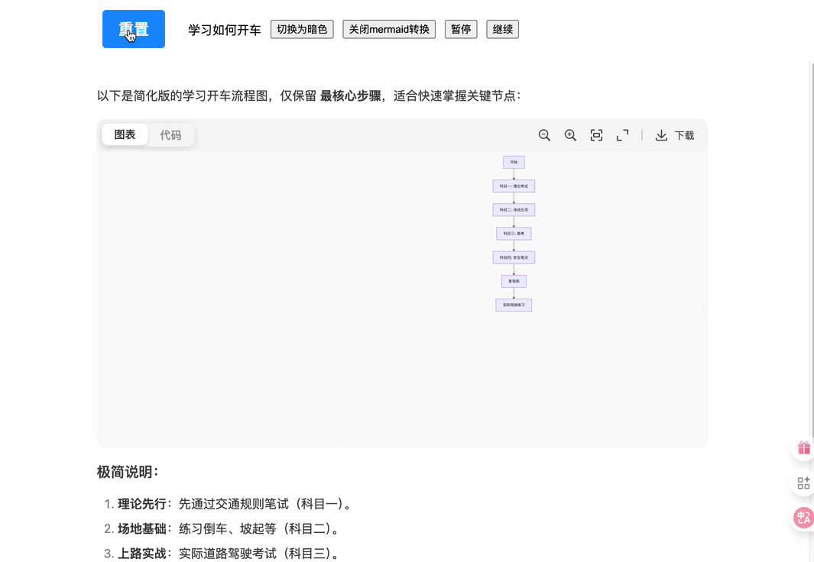

# ds-markdown

> 🚀 高性能 React Markdown 打字动画组件，完美复刻 DeepSeek 聊天界面效果

**🇨🇳 中文 | [🇺🇸 English](./README.en.md)**

一个专为现代 AI 应用设计的 React 组件，提供流畅的实时打字动画和完整的 Markdown 渲染能力。

[](https://www.npmjs.com/package/ds-markdown)
[](https://www.npmjs.com/package/ds-markdown)
[](https://bundlephobia.com/package/ds-markdown)
[](https://react.dev)
[](https://www.typescriptlang.org/)

- [使用文档](https://onshinpei.github.io/ds-markdown/)
- 使用示例
  - [基本用法](https://stackblitz.com/edit/vitejs-vite-ddfw8avb?file=src%2FApp.tsx)
  - [流式数据用法](https://stackblitz.com/edit/vitejs-vite-2ri8kex3?file=src%2FApp.tsx)
  - [mermaid图表](https://stackblitz.com/edit/vitejs-vite-iqbyta3j?file=index.html)
  - [数学公式demo1](https://stackblitz.com/edit/vitejs-vite-iqbyta3j?file=index.html)
  - [数学公式demo2](https://stackblitz.com/edit/vitejs-vite-xk9lxagc?file=src%2FApp.tsx)

如果你想要一个纯净的`react markdown` 打字组件，可以使用[react-markdown-typer](https://github.com/onshinpei/react-markdown-typer)

---

## ❓ 为什么要用 ds-markdown？

### 🎯 **解决的核心问题**

- **流式数据打字卡顿问题**  
  传统打字机组件在处理 AI 后端流式数据时，由于每个 chunk 包含多个字符，会出现卡顿、跳字等问题。ds-markdown 智能拆分每个 chunk，确保每个字符都流畅打字。

- **Markdown 渲染与打字动画割裂**  
  大多数打字机组件只支持纯文本，无法在打字过程中实时渲染 Markdown 语法、数学公式、图表等富媒体内容。

### 🚀 **带来的价值**

- **提升用户沉浸感**  
  提供专业级 AI 聊天体验，让用户感受到真实的 AI 交互过程，极大提升产品专业度和用户满意度。

- **开箱即用，降低开发复杂度**  
  完整的解决方案，无需额外配置即可支持流式数据、Markdown 渲染、数学公式、图表等复杂功能。

- **适配多种应用场景**  
  从 AI 聊天机器人到教育内容展示，从技术文档到产品演示，一个组件满足多种需求。

---

## 📋 目录

- [ds-markdown](#ds-markdown)
  - [❓ 为什么要用 ds-markdown？](#-为什么要用-ds-markdown)
    - [🎯 **解决的核心问题**](#-解决的核心问题)
    - [🚀 **带来的价值**](#-带来的价值)
  - [📋 目录](#-目录)
  - [✨ 核心特性](#-核心特性)
    - [🤖 **AI 对话场景**](#-ai-对话场景)
    - [📊 **内容展示场景**](#-内容展示场景)
    - [🎨 **UI组件系统** 🆕](#-ui组件系统-)
    - [🔧 **开发体验**](#-开发体验)
    - [🎬 **流畅动画**](#-流畅动画)
    - [⚡ **性能优化**](#-性能优化)
  - [📦 快速安装](#-快速安装)
    - [通过 ESM CDN 使用](#通过-esm-cdn-使用)
  - [🚀 5分钟上手](#-5分钟上手)
    - [基础用法](#基础用法)
    - [禁用打字动画](#禁用打字动画)
    - [数学公式支持](#数学公式支持)
    - [AI 对话场景](#ai-对话场景)
    - [代码块功能 🆕](#代码块功能-)
    - [Mermaid图表支持](#mermaid图表支持)
  - [📚 完整 API 文档](#-完整-api-文档)
    - [默认导出 DsMarkdown 和 MarkdownCMD 的 props](#默认导出-dsmarkdown-和-markdowncmd-的-props)

---

## ✨ 核心特性

### 🤖 **AI 对话场景**

- 专业级 AI 聊天响应效果，媲美主流 AI 平台体验
- 支持思考过程 (`thinking`) 和回答内容 (`answer`) 双模式
- 流式数据完美适配，零延迟响应用户输入

### 📊 **内容展示场景**

- 完整 Markdown 语法支持，包括代码高亮、表格、列表等
- 数学公式渲染 (KaTeX)，支持 `$...$` 和 `\[...\]` 语法
- Mermaid 图表支持，包括流程图、序列图、甘特图、类图等 🆕
- 支持亮色/暗色主题，适配不同产品风格
- 插件化架构，支持 remark/rehype 插件扩展

### 🎨 **UI组件系统** 🆕

- 代码块、图表增强功能：复制、下载、语言等
- 内置丰富的UI组件：Button、IconButton、ToolTip、Segmented等
- 完整的交互体验和无障碍支持

### 🔧 **开发体验**

- 丰富的命令式API：`start`、`stop`、`resume`、`restart` 等
- 支持打字中断与继续，灵活控制动画状态
- 支持打字关闭与开启，满足不同场景需求
- 完整的TypeScript类型支持

### 🎬 **流畅动画**

- 双模式定时器优化，支持`requestAnimationFrame`和`setTimeout`模式
- 高频打字支持（`requestAnimationFrame`模式下打字间隔最低可接近于`0ms`）
- 帧同步渲染，与浏览器刷新完美配合
- 智能字符批量处理，视觉效果更自然

### ⚡ **性能优化**

- 轻量级设计，体积小、性能优
- 核心依赖 [react-markdown](https://github.com/remarkjs/react-markdown)，无重量级依赖

---

## 📦 快速安装

```bash
# npm
npm install ds-markdown

# yarn
yarn add ds-markdown

# pnpm
pnpm add ds-markdown
```

### 通过 ESM CDN 使用

无需安装，直接在浏览器中使用：

[DEMO](https://stackblitz.com/edit/stackblitz-starters-7vcclcw7?file=index.html)

```html
<!-- 导入样式， 必须 -->
<link rel="stylesheet" href="https://esm.sh/ds-markdown/dist/style.css" />

<!-- 导入katex数学公式样式， 非不要不引入 -->
<link rel="stylesheet" href="https://esm.sh/ds-markdown/dist/katex.css" />

<!-- 导入组件 -->
<script type="module">
  import Markdown from 'https://esm.sh/ds-markdown';
</script>
```

## 🚀 5分钟上手

### 基础用法

[DEMO](https://stackblitz.com/edit/vitejs-vite-z94syu8j?file=src%2FApp.tsx)

```tsx
import DsMarkdown from 'ds-markdown';
import 'ds-markdown/style.css';

function App() {
  return (
    <DsMarkdown interval={20} answerType="answer">
      # Hello ds-markdown 这是一个**高性能**的打字动画组件！ ## 特性 - ⚡ 零延迟流式处理 - 🎬 流畅打字动画 - 🎯 完美语法支持
    </DsMarkdown>
  );
}
```

### 禁用打字动画

```tsx
import DsMarkdown from 'ds-markdown';
import 'ds-markdown/style.css';

function StaticDemo() {
  const [disableTyping, setDisableTyping] = useState(false);

  return (
    <div>
      <button onClick={() => setDisableTyping(!disableTyping)}>{disableTyping ? '开启' : '关闭'}打字机效果</button>

      <DsMarkdown interval={20} answerType="answer" disableTyping={disableTyping}>
        # 静态展示模式 当 `disableTyping` 为 `true` 时，内容会立即全部显示，无打字动画效果。 这在某些场景下非常有用： - 📄 静态文档展示 - 🔄 切换显示模式 - ⚡ 快速预览内容
      </DsMarkdown>
    </div>
  );
}
```

### 数学公式支持

```tsx
import DsMarkdown from 'ds-markdown';
// 如果需要展示公式，则需要引入公式转换插件
import { katexPlugin } from 'ds-markdown/plugins';
import 'ds-markdown/style.css';
// 如果需要展示公式，则需要引入数学公式样式
import 'ds-markdown/katex.css';

function MathDemo() {
  return (
    <DsMarkdown interval={20} answerType="answer" plugins={[katexPlugin]} math={{ splitSymbol: 'dollar' }}>
      # 勾股定理 在直角三角形中，斜边的平方等于两条直角边的平方和： $a^2 + b^2 = c^2$ 其中： - $a$ 和 $b$ 是直角边 - $c$ 是斜边 对于经典的"勾三股四弦五"： $c = \sqrt{3 ^ (2 + 4) ^ 2} = \sqrt{25} = 5$
    </DsMarkdown>
  );
}
```

### AI 对话场景

```tsx
function ChatDemo() {
  const [thinking, setThinking] = useState('');
  const [answer, setAnswer] = useState('');

  const handleAsk = () => {
    setThinking('🤔 正在思考您的问题...');

    setTimeout(() => {
      setAnswer(`# 关于 React 19

React 19 带来了许多激动人心的新特性：

## 🚀 主要更新
1. **React Compiler** - 自动优化性能
2. **Actions** - 简化表单处理
3. **Document Metadata** - 内置 SEO 支持

让我们一起探索这些新功能！`);
    }, 2000);
  };

  return (
    <div>
      <button onClick={handleAsk}>询问 AI</button>

      {thinking && (
        <DsMarkdown answerType="thinking" interval={30}>
          {thinking}
        </DsMarkdown>
      )}

      {answer && (
        <DsMarkdown answerType="answer" interval={15}>
          {answer}
        </DsMarkdown>
      )}
    </div>
  );
}
```

### 代码块功能 🆕

```tsx
import DsMarkdown from 'ds-markdown';
import 'ds-markdown/style.css';

function CodeBlockDemo() {
  const codeContent = `# Hello World

\`\`\`javascript
function greet(name) {
  console.log(\`Hello, \${name}!\`);
}

greet('ds-markdown');
\`\`\`

支持代码高亮、复制和下载功能！`;

  return (
    <DsMarkdown
      interval={20}
      answerType="answer"
      codeBlock={{
        headerActions: true, // 启用代码块头部操作按钮
      }}
    >
      {codeContent}
    </DsMarkdown>
  );
}
```

### Mermaid图表支持

[DEMO](https://stackblitz.com/edit/vitejs-vite-iqbyta3j?file=README.md)

```tsx
import DsMarkdown from 'ds-markdown';
import { ConfigProvider } from 'ds-markdown';
import mermaidPlugin from 'ds-markdown-mermaid-plugin';
import 'ds-markdown/style.css';

function MermaidDemo() {
  const chartContent = `以下是简化版的学习开车流程图，仅保留 **最核心步骤**，适合快速掌握关键节点：

\`\`\`mermaid
graph TD
    A[开始] --> B[科目一: 理论考试]
    B --> C[科目二: 场地五项]
    C --> D[科目三: 路考]
    D --> E[科目四: 安全笔试]
    E --> F[拿驾照]
    F --> G[实际驾驶练习]
\`\`\`

### 极简说明：
1. **理论先行**：先通过交通规则笔试（科目一）。
2. **场地基础**：练习倒车、坡起等（科目二）。
3. **上路实战**：实际道路驾驶考试（科目三）。
4. **安全收尾**：通过科目四即可领证。
5. **持续熟练**：拿证后继续练习适应真实路况。

### 可视化建议：
- 用手机备忘录或白纸手绘时，按 **箭头顺序** 写步骤即可。
- 想更直观？用圆形便签贴出每个科目，连线成流程。`;

  return (
    <ConfigProvider>
      <DsMarkdown interval={20} answerType="answer" plugins={[mermaidPlugin]}>
        {chartContent}
      </DsMarkdown>
    </ConfigProvider>
  );
}
```



---

## 📚 完整 API 文档

### 默认导出 DsMarkdown 和 MarkdownCMD 的 props

```js
import DsMarkdown, { MarkdownCMD } from 'ds-markdown';
```

| 属性                | 类型                                        | 说明                                                          | 默认值                                                      |
| ------------------- | ------------------------------------------- | ------------------------------------------------------------- | ----------------------------------------------------------- |
| `interval`          | `number`                                    | 打字间隔 (毫秒)                                               | `30`                                                        |
| `timerType`         | `'setTimeout'` \| `'requestAnimationFrame'` | 定时器类型，不支持动态修改                                    | 当前默认值是`setTimeout`，后期会改为`requestAnimationFrame` |
| `answerType`        | `'thinking'` \| `'answer'`                  | 内容类型 (影响样式主题)，不支持动态修改                       | `'answer'`                                                  |
| `theme`             | `'light'` \| `'dark'`                       | 主题类型                                                      | `'light'`                                                   |
| `plugins`           | `IMarkdownPlugin[]`                         | 插件配置                                                      | `[]`                                                        |
| `math`              | [IMarkdownMath](#IMarkdownMath)             | 数学公式配置                                                  | `{ splitSymbol: 'dollar' }`                                 |
| `onEnd`             | `(data: EndData) => void`                   | 打字结束回调                                                  | -                                                           |
| `onStart`           | `(data: StartData) => void`                 | 打字开始回调                                                  | -                                                           |
| `onBeforeTypedChar` | `(data: IBeforeTypedChar) => Promise<void>` | 字符打字前的回调，支持异步操作，会阻塞之后的打字              | -                                                           |
| `onTypedChar`       | `(data: ITypedChar) => void`                | 每字符打字后的回调                                            | -                                                           |
| `disableTyping`     | `boolean`                                   | 禁用打字动画效果                                              | `false`                                                     |
| `autoStartTyping`   | `boolean`                                   | 是否自动开始打字动画，设为 false 时需手动触发，不支持动态修改 | `true`                                                      |
| `codeBlock`         | `IMarkdownCode`                             | 代码块配置                                                    | `{headerActions: true}`                                     |

> 注意： 如果当在打字中 `disableTyping`从 `true` 变为 `false`
