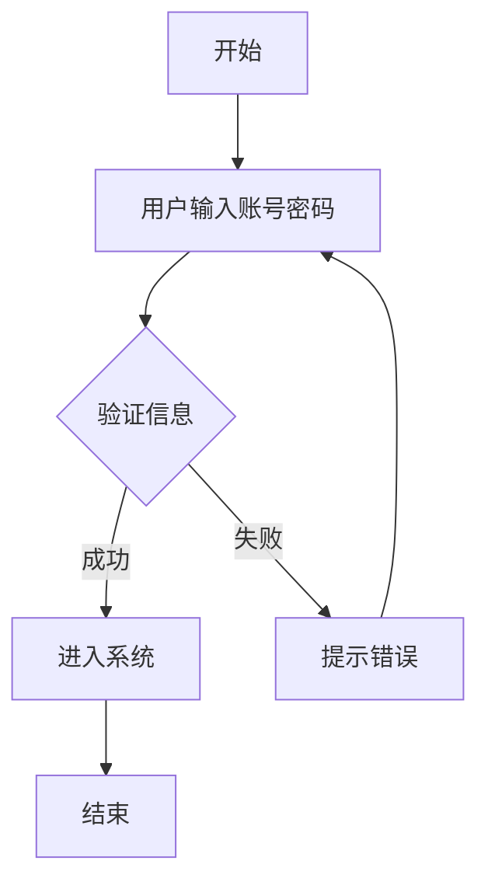

```mermaid
graph TD
    A[开始] --> B[用户输入账号密码]
    B --> C{验证信息}
    C -- 成功 --> D[进入系统]
    C -- 失败 --> E[提示错误]
    D --> F[结束]
    E --> B
```

---

### **如何帮你？**

1. **描述你的需求**（比如业务逻辑、算法步骤等）。
2. **选择输出形式**：文字步骤、Mermaid、PlantUML等。
3. 我会生成内容，你复制到绘图工具即可！

需要试试吗？可以告诉我你的具体场景 😊
