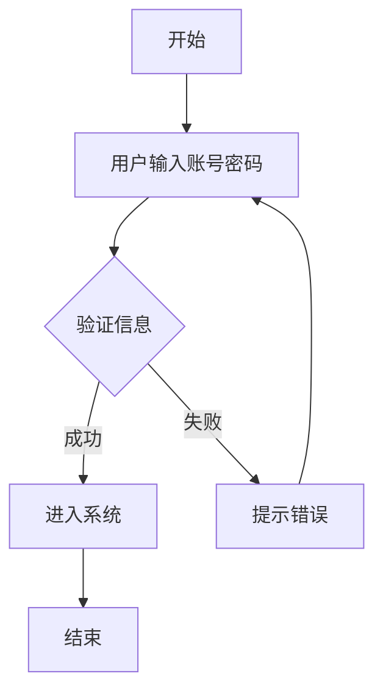

当然可以！虽然我无法直接绘制图形，但我可以帮你设计流程图的 **文字结构**，或者用 **代码（如Mermaid、PlantUML）** 生成流程图。你可以根据我的描述用工具（如Visio、Draw.io、Lucidchart）绘制出来。

---

### **示例1：简单流程图（文字描述）**

比如 **"用户登录流程"**：

1. **开始** → 用户打开登录页面
2. **输入** 用户名和密码
3. **验证数据**
   - 如果正确 → 进入主页
   - 如果错误 → 显示错误提示
4. **结束**

---

### **示例2：Mermaid代码（可直接粘贴到支持Mermaid的工具中）**

---

### **如何帮你？**

1. **描述你的需求**（比如业务逻辑、算法步骤等）。
2. **选择输出形式**：文字步骤、Mermaid、PlantUML等。
3. 我会生成内容，你复制到绘图工具即可！

需要试试吗？可以告诉我你的具体场景 😊
