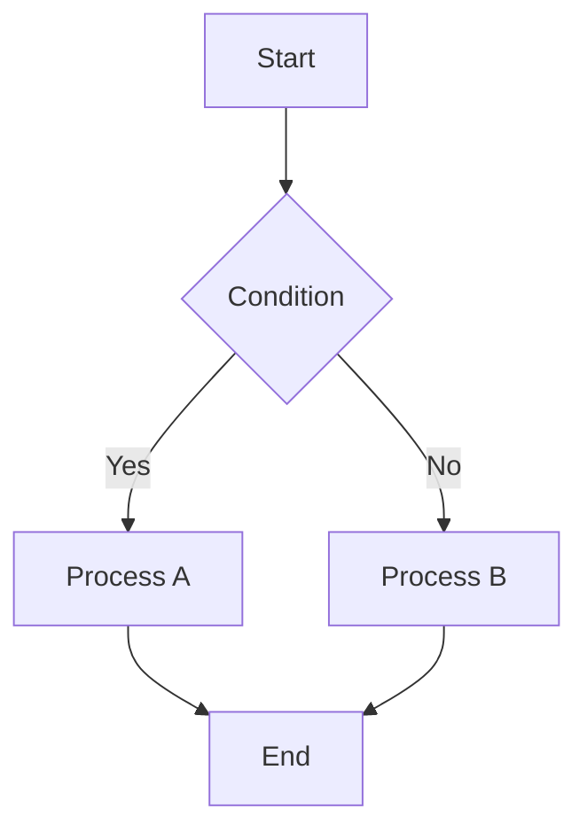
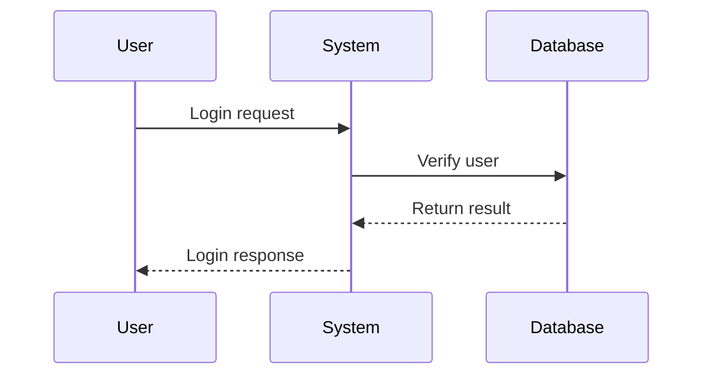
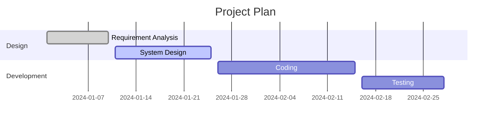
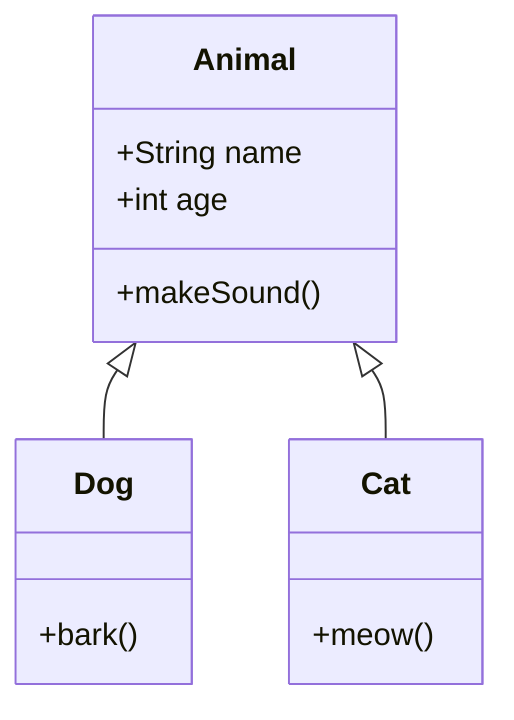
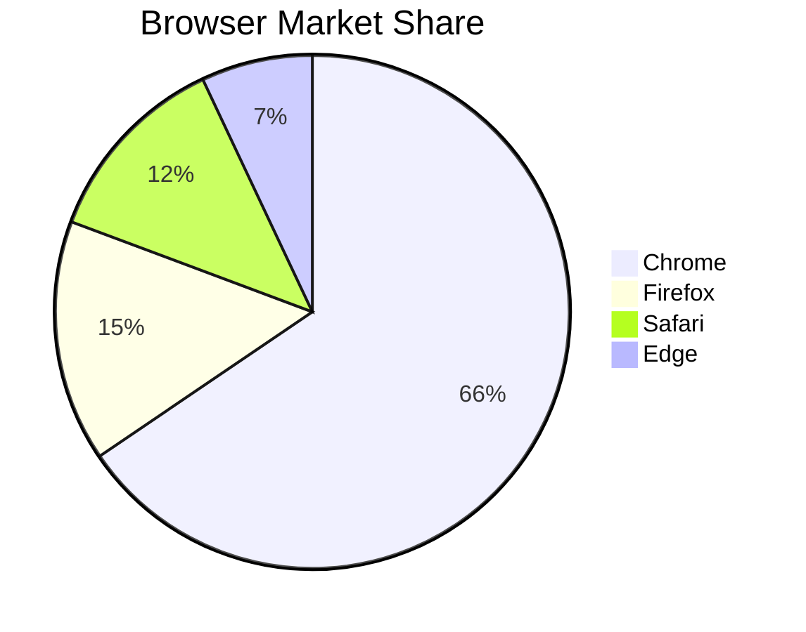
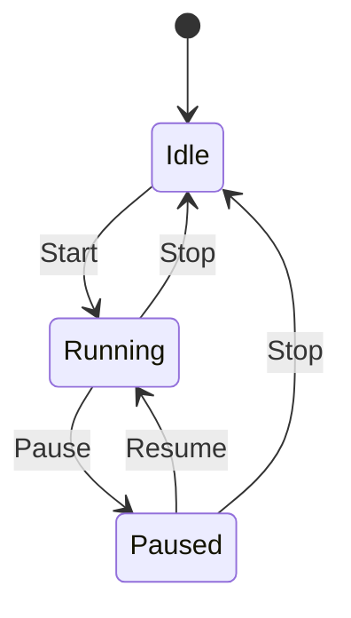

# 🧩 Mermaid Chart Demo

Below are various chart types supported by Mermaid:

## Flowchart

```mermaid
flowchart TD
    A[Start] --> B{Condition}
    B -->|Yes| C[Process A]
    B -->|No| D[Process B]
    C --> E[End]
    D --> E
```

## Sequence Diagram

```mermaid
sequenceDiagram
    participant User
    participant System
    participant Database
    User->>System: Login request
    System->>Database: Verify user
    Database-->>System: Return result
    System-->>User: Login response
```

## Gantt Chart

```mermaid
gantt
    title Project Plan
    dateFormat  YYYY-MM-DD
    section Design
    Requirement Analysis    :done, des1, 2024-01-01, 2024-01-10
    System Design           :active, des2, 2024-01-11, 2024-01-25
    section Development
    Coding                  :des3, 2024-01-26, 2024-02-15
    Testing                 :des4, 2024-02-16, 2024-02-28
```

## Class Diagram

```mermaid
classDiagram
    class Animal {
        +String name
        +int age
        +makeSound()
    }
    class Dog {
        +bark()
    }
    class Cat {
        +meow()
    }
    Animal <|-- Dog
    Animal <|-- Cat
```

## Pie Chart

```mermaid
pie title Browser Market Share
    "Chrome" : 65.5
    "Firefox" : 15.2
    "Safari" : 12.3
    "Edge" : 7.0
```

## State Diagram

```mermaid
stateDiagram-v2
    [*] --> Idle
    Idle --> Running : Start
    Running --> Paused : Pause
    Paused --> Running : Resume
    Running --> Idle : Stop
    Paused --> Idle : Stop
```
