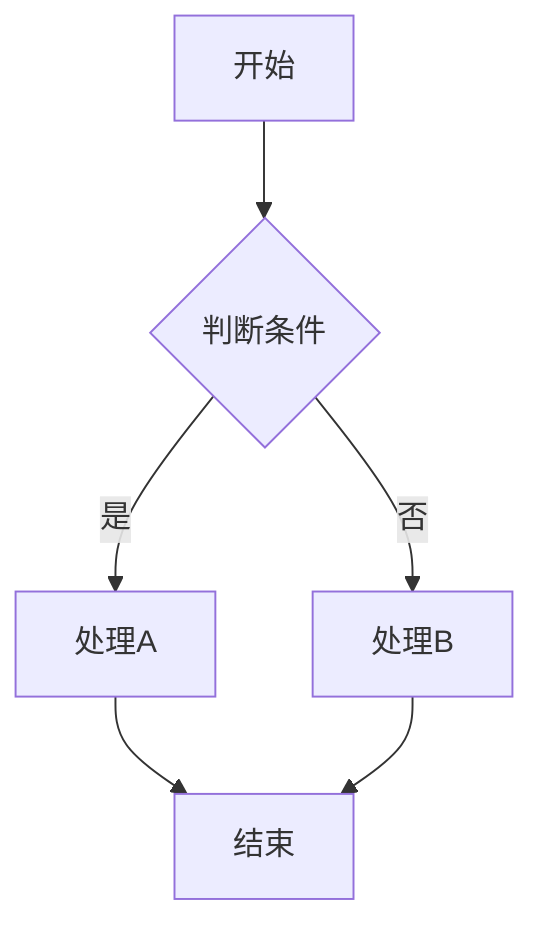
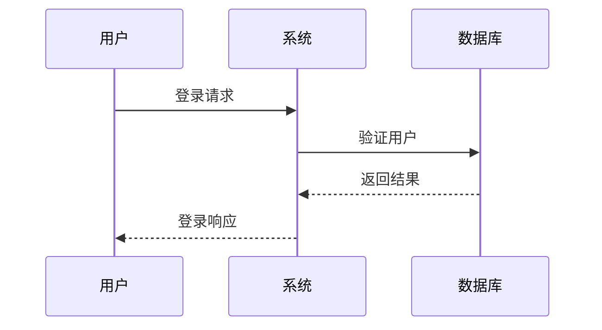
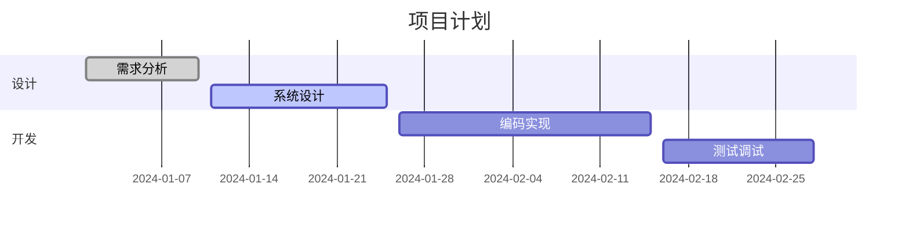
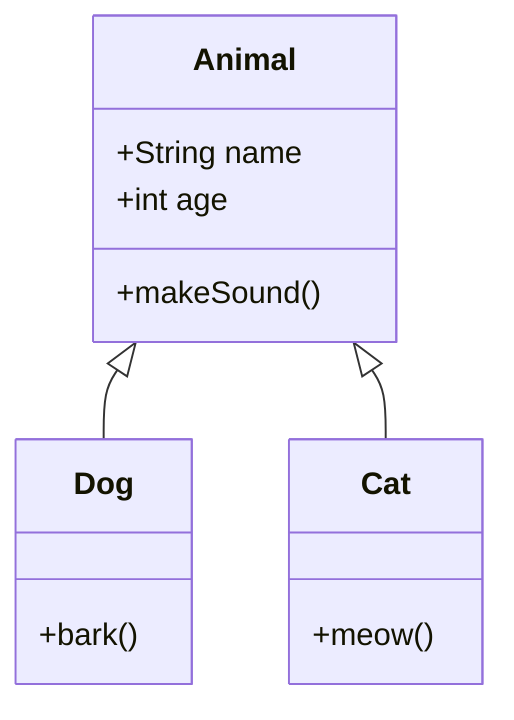
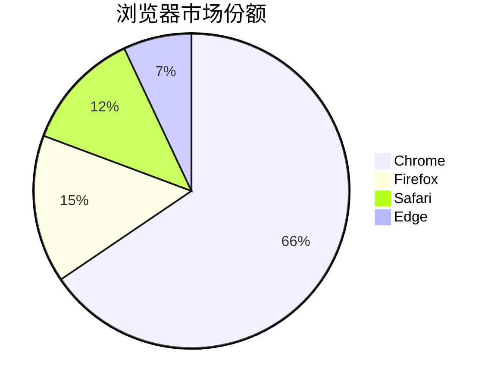
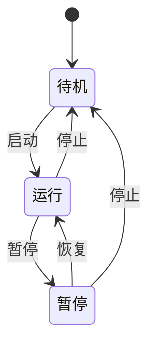

# 🧩 Mermaid 图表示例

下面展示了多种 Mermaid 支持的图表类型：

## 流程图

```mermaid
flowchart TD
    A[开始] --> B{判断条件}
    B -->|是| C[处理A]
    B -->|否| D[处理B]
    C --> E[结束]
    D --> E
```

## 序列图

```mermaid
sequenceDiagram
    participant 用户
    participant 系统
    participant 数据库
    用户->>系统: 登录请求
    系统->>数据库: 验证用户
    数据库-->>系统: 返回结果
    系统-->>用户: 登录响应
```

## 甘特图

```mermaid
gantt
    title 项目计划
    dateFormat  YYYY-MM-DD
    section 设计
    需求分析    :done, des1, 2024-01-01, 2024-01-10
    系统设计    :active, des2, 2024-01-11, 2024-01-25
    section 开发
    编码实现    :des3, 2024-01-26, 2024-02-15
    测试调试    :des4, 2024-02-16, 2024-02-28
```

## 类图

```mermaid
classDiagram
    class Animal {
        +String name
        +int age
        +makeSound()
    }
    class Dog {
        +bark()
    }
    class Cat {
        +meow()
    }
    Animal <|-- Dog
    Animal <|-- Cat
```

## 饼图

```mermaid
pie title 浏览器市场份额
    "Chrome" : 65.5
    "Firefox" : 15.2
    "Safari" : 12.3
    "Edge" : 7.0
```

## 状态图

```mermaid
stateDiagram-v2
    [*] --> 待机
    待机 --> 运行 : 启动
    运行 --> 暂停 : 暂停
    暂停 --> 运行 : 恢复
    运行 --> 待机 : 停止
    暂停 --> 待机 : 停止
```
